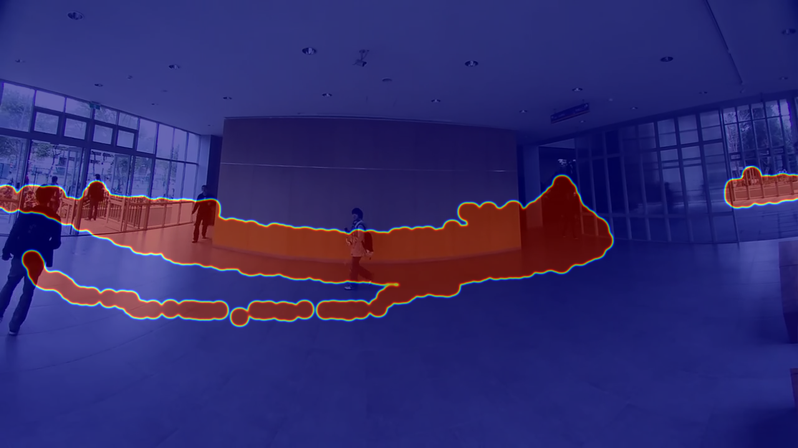

# AI Footfall Counter API (with FastAPI)

## 1. Project Overview

This project implements the **Footfall Counter** computer vision task as a robust, high-performance web API using **FastAPI**. It successfully fulfills the "Deploying a small API" bonus requirement from the original assignment.

The API provides an endpoint where users can upload a video file. The server processes the video in a headless environment, performs person detection and tracking using YOLOv8, and returns a JSON response containing the final IN/OUT counts along with publicly accessible URLs for the generated heatmap and annotated video.

This architecture decouples the complex AI logic from the user interface, allowing any client (a web app, a mobile app, another script) to consume its services.


*(Example: A final heatmap generated by the API)*

---

## 2. Key Features

-   **FastAPI Backend**: Built on a modern, high-performance ASGI framework.
-   **RESTful Endpoint**: A clear `/process-video/` endpoint for video analysis.
-   **File Uploads**: Accepts standard video file uploads via a POST request.
-   **Headless AI Processing**: The core YOLOv8 and OpenCV logic runs on the server without needing a GUI.
-   **JSON Response**: Returns structured data including counts and URLs, perfect for programmatic use.
-   **Static File Serving**: Makes the output video and heatmap image available for download via URLs.
-   **Auto-Generated Documentation**: Includes interactive API documentation (Swagger UI) for easy testing.

---

## 3. Project Structure

The project is organized into modules for better maintainability and separation of concerns.

```
footfall-api/
├── uploads/              # Temporary storage for uploaded videos
├── outputs/              # Storage for all processed videos and heatmaps
├── main.py               # The main FastAPI application, defines API endpoints
├── counter_logic.py      # The core, headless computer vision processing module
└── requirements.txt      # A list of all project dependencies
```

---

## 4. Tech Stack

-   **Backend**: FastAPI, Uvicorn (ASGI Server)
-   **Computer Vision**: OpenCV
-   **AI/ML**: Ultralytics YOLOv8
-   **Core Libraries**: NumPy, SciPy, Python-Multipart

---

## 5. Setup and Installation

Follow these steps to set up and run the API server on your local machine.

#### A. Prerequisites

-   Python 3.8 or newer.
-   `pip` for package management.


#### B. Create a Virtual Environment

It is highly recommended to use a virtual environment to manage project dependencies.

```bash
# For macOS/Linux
python3 -m venv venv
source venv/bin/activate

# For Windows
python -m venv venv
venv\Scripts\activate
```

#### C. Install Dependencies

Install all required packages from the `requirements.txt` file.

```bash
pip install -r requirements.txt
```
*(The first time `counter_logic.py` is run, `ultralytics` will automatically download the necessary YOLOv8 model weights.)*

---

## 6. How to Run the API Server

Once the setup is complete, you can start the API server.

#### A. Start the Uvicorn Server

From the root directory (`footfall-api/`), run the following command in your terminal:

```bash
uvicorn main:app --reload
```

-   `main`: Refers to the `main.py` file.
-   `app`: Refers to the `app = FastAPI()` object created inside `main.py`.
-   `--reload`: Enables live-reloading, so the server restarts automatically when you make code changes.

You should see an output indicating the server is running, typically on `http://127.0.0.1:8000`.

---

## 7. API Usage and Endpoints

The server provides automatically generated, interactive API documentation.

#### A. Access the Interactive Docs

Open your web browser and navigate to:
**[http://127.0.0.1:8000/docs](http://127.0.0.1:8000/docs)**

#### B. The `/process-video/` Endpoint

This is the main endpoint for analyzing a video.

-   **Method**: `POST`
-   **Description**: Accepts a video file, processes it using the footfall counter logic, and returns the results.
-   **How to Test**:
    1.  On the docs page, expand the `POST /process-video/` section.
    2.  Click "Try it out".
    3.  Under "Request body", click "Choose File" and select a video you want to analyze.
    4.  Click the "Execute" button.

#### C. Example Successful Response

After processing is complete, the API will return a `200 OK` response with a JSON body similar to this:

```json
{
  "message": "Video processed successfully!",
  "counts": {
    "in": 5,
    "out": 3
  },
  "results": {
    "processed_video_url": "/outputs/processed_a1b2c3d4.mp4",
    "heatmap_image_url": "/outputs/heatmap_a1b2c3d4.mp4.png"
  }
}
```

You can then access the generated files by combining the server URL with the paths provided in the response:

-   **Video**: `http://127.0.0.1:8000/outputs/processed_a1b2c3d4.mp4`
-   **Heatmap**: `http://127.0.0.1:8000/outputs/heatmap_a1b2c3d4.mp4.png`
